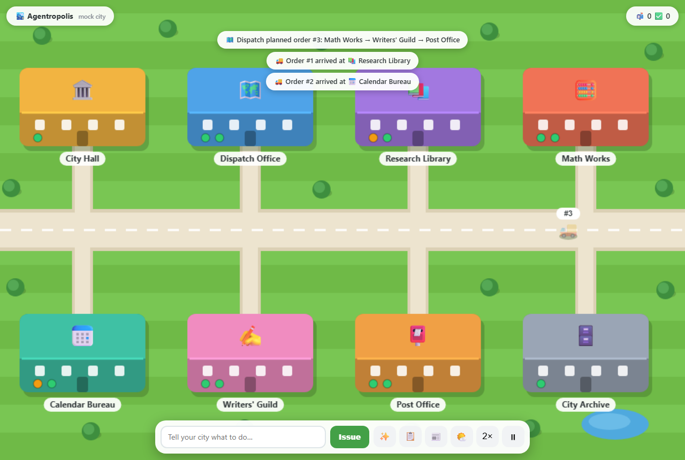
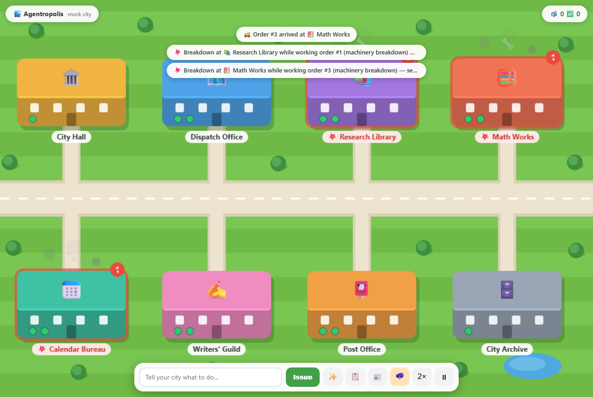

# 🏙️ Agentropolis

**AI agent orchestration you can watch like a city builder.**

Most agent-orchestration tools look like flowcharts and YAML. Agentropolis asks: what if
your agents lived in a little city instead?

| City thing | Orchestration thing |
|---|---|
| 🏛️ City Hall / the Governor (you) | Human in the loop — issues orders, receives results |
| 🗺️ Dispatch Office | Planner/router — decides which agents handle an order, in what sequence |
| 🏢 Buildings (Calendar Bureau, Research Library, Writers' Guild, Math Works, Post Office) | Specialized agents |
| 🚚 Trucks | Message payloads moving between agents |
| 🛣️ Roads | Connections/channels between agents |
| 👷 Worker dots inside a building | Concurrency slots (watch a queue form when a department is slammed) |
| 🗄️ City Archive | Long-term memory / task history |

Type an order in plain English in the bar at the bottom — *"Research electric bikes and
write a short report"* — and watch a truck carry it to Dispatch, get routed through the
Research Library and the Writers' Guild, and come back to City Hall with results.

**▶ [Play it in your browser](https://blahblah23406.github.io/agentropolis/)** — no install, single HTML file.

The city itself is the interface, Pocket City-style: **tap a building** to see who works
there and what they're doing, **tap a truck** to peek at its payload, and use the 📋
button for order progress and 📰 for the live city news. Flip on **🌩️ chaos** and
departments break down mid-job — the building smokes and its line grows until you tap it
to send a 🚒 repair crew (that's a retry with a human in the loop; three strikes and the
order comes home with an error note). The ✨ button has sample orders plus **🚦 rush
hour**, which issues 8 orders at once so you can watch queues form.




## Run it

Zero dependencies. Node 18+.

```bash
node server.js        # then open http://localhost:8347
```

- `http://localhost:8347/?demo=1` — auto-issues three sample orders on load.
- `npm test` — 9 engine tests (routing, pipelines, concurrency, failure handling).
- `node demo.js` — run the whole city headlessly in your terminal.
- `npm run build` — bundle everything into a single `dist/agentropolis.html` you can open from disk.

## Real LLM agents (optional)

By default departments are mocks so the demo works anywhere. Point the city at any
[Ollama](https://ollama.com) server and every building becomes a real LLM agent with its
own role prompt — including the **Dispatch Office**, which then genuinely *plans* each
order's pipeline instead of keyword-matching (plans marked 🧠 in the Gazette). If the
LLM answers nonsense or is unreachable, Dispatch falls back to keyword routing so no
order ever dead-ends:

```bash
OLLAMA_URL=http://your-ollama-host:11434 node server.js
# then open http://localhost:8347/?llm=1&model=llama3.2
```

The engine (`src/engine.js`) is UI-agnostic: `city.workers[deptId] = async (task, input) => output`
lets you plug in any backend — an API call, a Claude/GPT agent, a shell command.

## Why

Agent orchestration is powerful and almost entirely inaccessible to non-developers.
Node-graph tools (n8n, Flowise, Sim) still assume you think in DAGs. Agentropolis bets
that everyone already understands a city: mail goes to the post office, research happens
at the library, and the mayor's office is where you complain. The city isn't decoration —
it's a live, legible dashboard of real work: queues are visible crowds, bottlenecks are
traffic, failures are trucks coming home with an error note.

See [FEASIBILITY.md](FEASIBILITY.md) for the market/novelty analysis behind this prototype.

## Status

Weekend-sized prototype. Honest limitations: sequential pipelines only (no fan-out/join
yet), no persistence, one hardcoded map, and mock mode's dispatch is keyword-based (LLM
mode plans for real).

MIT licensed. Built with help from Claude (Anthropic's AI assistant).
